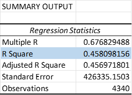
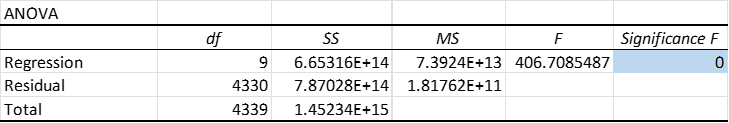
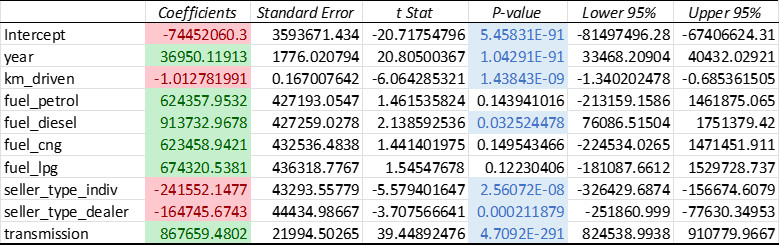

# Stat Homework1: Used Cars price prediction

Original Dataset and columns description from : https://www.kaggle.com/datasets/nehalbirla/vehicle-dataset-from-cardekho

This dataset contains
- The variable we would like to predict is `selling_price` - price at which the car is being sold.

**Independent variables**:
- `year` - Year of the car when it was bought  
- `km_driven` - Number of Kilometres the car is driven
- `transmission` - Gear transmission of the car (1=Automatic, 0=Manual)

    The original `fuel` and `seller_type` variables are encoded as
- `fuel_petrol` - Whether the car fuel is *petrol*. (1=True, 0=False)
- `fuel_diesel` - Whether the car fuel is *diesel*. (1=True, 0=False)
- `fuel_cng` - Whether the car fuel is *CNG*. (1=True, 0=False)
- `fuel_lpg` - Whether the car fuel is *LPG*. (1=True, 0=False)
- `seller_type_indiv` - Seller type is *individual*.
- `seller_type_dealer` - Seller type is *dealer*.

## Analysis
**Summary output**

Linear model :
 
$sellingprice = b_{0} + b_{1} \ast year + b_{2} \ast kmdriven + b_{3} \ast fuel_{petrol} + b_{4} \ast fuel_{diesel} + b_{5} \ast fuel_{cng} + b_{6} \ast fuel_{lpg} +$
$b_{7} \ast sellertype_{individual} + b_{8} \ast sellertype_{dealer} + b_{9} \ast transmission$

Summary output shows that this model could explain selling price variable 45.8%.

From ANOVA table means that there are at least 1 independent variables in the model can predict selling price significantly.

Moreover, `year`, `km_driven`, `fuel_diesel`, seller type, transmission have significant relationship with price.
